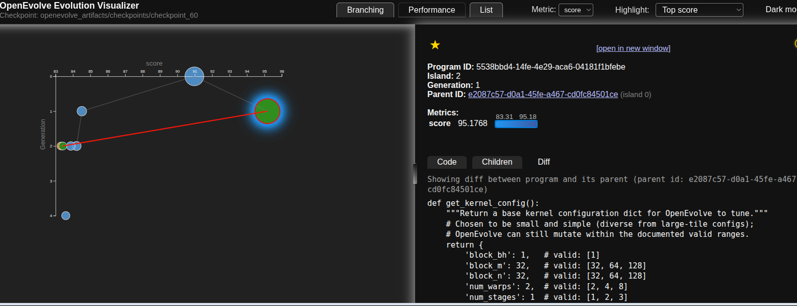
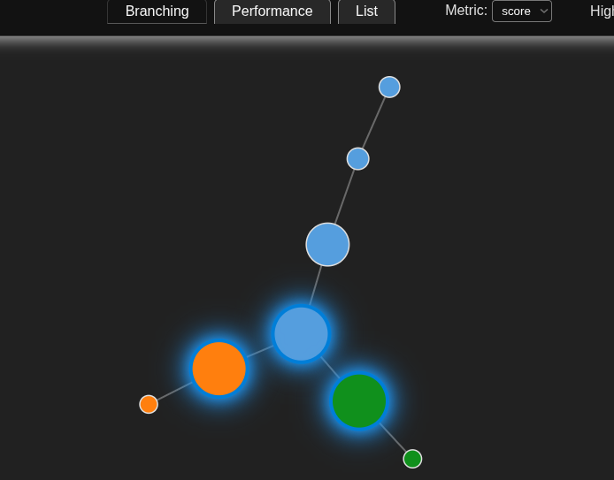
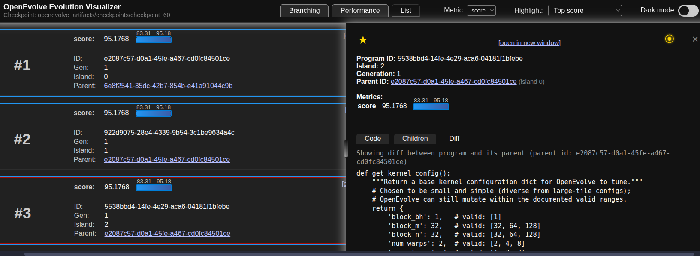
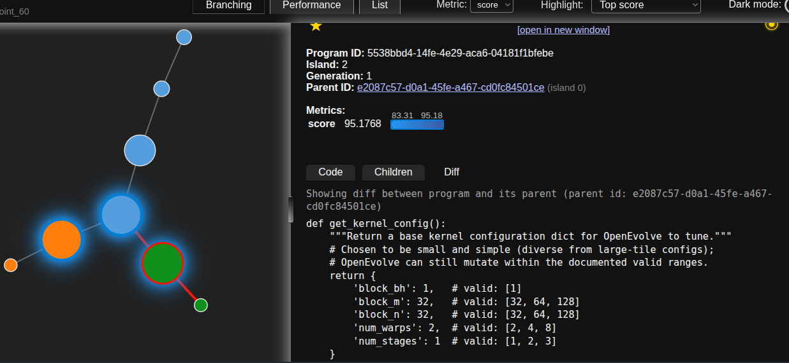

# AMD R9700 Kernel Evolution: How OpenEvolve Explores GQA Attention

This post explains how Helion’s OpenEvolve autotuner generates candidates, how they are evaluated, and why it can improve kernels beyond naive search. It also calls out what we record today and what we still do not. The experiments here were run on AMD GPUs with ROCm 7.1.0.

## What candidate generation means

OpenEvolve does not mutate a kernel. It mutates a small Python program that returns a literal config dict. Helion then compiles the kernel with that config. A candidate looks like this:

```python
def get_kernel_config():
    config = {
        "block_bh": 1,
        "block_m": 64,
        "block_n": 128,
        "num_warps": 4,
        "num_stages": 2,
    }
    return config
```

That program is the genome. OpenEvolve edits only literal values. This keeps mutation legal and the search space bounded.

## Where the search space comes from

You define a config space like:

```python
config_space = {
    "block_bh": [1],
    "block_m": [32, 64, 128],
    "block_n": [32, 64, 128],
    "num_warps": [2, 4, 8],
    "num_stages": [1, 2, 3],
}
```

OpenEvolve may pick only from these lists. Anything else is rejected and scored 0.0.

## Evaluation pipeline

Each candidate goes through the same pipeline:

1) **Program mutated** by the LLM (it only changes literal values).
2) **Config extracted** from `get_kernel_config()`.
3) **Validation**: ensure all values are in the config space.
4) **Objective function**: compile/run the kernel and measure score (TFLOPS).
5) **Artifacts written**: program text, config, score, and timing are dumped to disk.

This is what makes it measurable.

## Why progress is possible

Kernel performance is sensitive to a few discrete knobs:

- **Block sizes** determine the tile shape (compute/data reuse balance).
- **Warps** determine occupancy and scheduling granularity.
- **Stages** affect pipelining and latency hiding.

These are not tiny changes. Each mutation can shift register pressure, shared memory usage, and occupancy. Even a small config space can be high‑contrast. That is why a handful of integer knobs can move performance.

## How to read the artifacts

Artifacts are saved to `openevolve_artifacts/` by default. The key files:

- `eval_00042.json`: program, config, score, error, duration.
- `eval_00042.py`: the exact mutated program.
- `tuning_summary.json`: full history with **best‑so‑far** and **improvement vs prior best**.

The summary includes `improvement_vs_best`. It shows best‑so‑far over time and makes plateaus obvious.

### Visualizations

Score and improvement over time:



Evolution graph (parents to children):



Candidate list view (configs and scores):



Diff view of candidate program changes:



## Where is the model’s reasoning

OpenEvolve does not expose per‑mutation reasoning.

What we can show today:
- the full candidate program
- the config
- the score
- whether it failed or passed validation

What we cannot show today:
- a natural language explanation of why the LLM chose a diff
- a justification of why it expected a gain

This is a limitation of the OpenEvolve interface. If we want this, we must request it and store it. That means extending the mutation prompt or wrapping OpenEvolve so it emits a reasoning field with the program.

## Why local maxima still happen

OpenEvolve uses population + islands, not always mutate the best. That is intentional:

- It keeps diversity so we do not get trapped too early.
- It explores multiple basins in parallel.
- It explores worse candidates to find new peaks.

Many candidates will not beat the best‑so‑far. That is expected and shows up as negative `improvement_vs_best`.

If you want a greedier search, reduce islands, reduce population size, and lower temperature.

## Seeding from a strong baseline

OpenEvolve now seeds from the Helion baseline config by default. This matters.
Starting from a proven config shortens the path to good results and reduces wasted
evaluations on bad regions. It is simple and it pays for itself when each eval is
real GPU time.

In practice, this turns tuning into refinement, not reinvention. Helion already
gives you a working baseline. Seeding means OpenEvolve spends time improving it
instead of rediscovering it.

## Next steps for explainability

If you want true “why did it make this change” reasoning:

- Extend the mutation prompt to return a JSON payload with `config`, `reasoning`, and `expected_effect`.
- Save that reasoning alongside each candidate.

This is small conceptually, but it needs changes in OpenEvolve or a wrapper to capture the model response before it is reduced to code.

## Takeaway

This tuning loop is measurable. Every config, score, and program is on disk. The
LLM’s intent is not. If we want that, we must ask for it and store it. Until then,
the numbers are the ground truth.

## Results

This section is updated as new runs complete. The latest report is written to:
`openevolve_artifacts/qwen3_gqa_report/qwen3_gqa_results.md`

If you want a quick snapshot, see the auto-updated block below.

<!-- RESULTS:START -->
```
| impl | avg_ms | tflops | speedup_vs_eager | tuning_time_s | note |
| --- | --- | --- | --- | --- | --- |
| sdpa_eager | 25.387704849243164 | 43.308823475973945 | 1.0 | None |  |
| sdpa_torch_compile | 22.468698501586914 | 48.93526110105327 | 1.1299143493981232 | None |  |
| helion_baseline | 9.181479835510254 | 119.75320400133465 | 2.765099450641255 | None |  |
| helion_openevolve | 8.357611482793635 | 131.5581168183801 | 3.037674687500191 | 1209.0990149450008 |  |
```
Updated: 2026-01-02 23:04:09


<!-- RESULTS:END -->

## Results in detail

These numbers are for Qwen3‑style GQA at B=4, H_q=32, H_kv=8, S=4096, D=128.
The runs were done on a machine with two AMD Radeon R9700 GPUs. This matters
because the shape and block sizes chosen here are sensitive to the GPU’s
memory bandwidth and occupancy behavior.

## Hardware notes

This run targets two AMD Radeon AI PRO R9700 GPUs. ROCm 7.1.0 is installed with
amdgpu 6.14.0-37. Each card reports 30 GB of VRAM. Power limit is 300 W. The
kernel is bandwidth heavy: QK, softmax, and V all stream through memory. In that
regime, tile size and warp count are dominant levers. Small tiles reduce reuse,
large tiles can reduce occupancy. The tuning knobs in this post exist to balance
those two effects.

If you run on a different GPU, expect different winners. The method stays the
same, but the peak shifts with cache sizes, memory bandwidth, and SM count.
The tuned kernel in this run used:

```
block_bh=1, block_m=16, block_n=16, num_warps=1, num_stages=1
```

That config is small and conservative. It is fast, but it did not beat the fixed
Helion baseline in this run.

The baseline and tuned results tell a clear story:

- `sdpa_eager` is slowest at ~25 ms and ~44 TFLOPS.
- `sdpa_torch_compile` is a small win over eager, ~22.5 ms.
- `helion_baseline` is the fastest here, ~9.10 ms and ~121 TFLOPS.
- `helion_openevolve` is slower than baseline at ~10.20 ms and ~108 TFLOPS.

The tuning cost is also visible. The run above took ~532 seconds. That is not free,
but it is small compared to the cost of running a full training or serving workload.

This is also a good reminder: OpenEvolve is not magic. It explores. It does not
guarantee a better config on every run. It does, however, make the search measured,
repeatable, and easy to extend.

## How the Qwen3 attention patch works

The kernel is tested in isolation, and it can also be inserted into Qwen3 by
monkey‑patching the model’s attention forward pass. The patch does this:

1. It intercepts each attention layer and replaces `forward` with a wrapper.
2. The wrapper projects the hidden states to Q, K, V with the model’s own linear
   layers.
3. It reshapes Q to (B, H_q, S, D) and K/V to (B, H_kv, S, D).
4. It applies RoPE if the model uses rotary embeddings.
5. It updates the KV cache when running in decode mode.
6. It calls the custom kernel on Q, K, V.
7. It restores the output shape and applies the output projection.

That gives a direct, apples‑to‑apples comparison between the stock attention
path and the custom kernel on the same model, inputs, and cache behavior.

## Steps to reproduce

1. Run the tuning script:

```
uv run python examples/qwen3_gqa_openevolve_tuning.py
```

2. Open the report:

```
openevolve_artifacts/qwen3_gqa_report/qwen3_gqa_results.md
```

3. View the plot:

```
openevolve_artifacts/qwen3_gqa_report/qwen3_gqa_results.png
```

4. Check the full candidate history:

```
openevolve_artifacts/eval_*.json
openevolve_artifacts/tuning_summary.json
```

## Conclusion

Kernel performance is a policy decision expressed as a small set of integers.  OpenEvolve makes that policy explicit and auditable. It records every candidate, every score, and every failure. So, you can see what was tried, what worked, and what did not.
